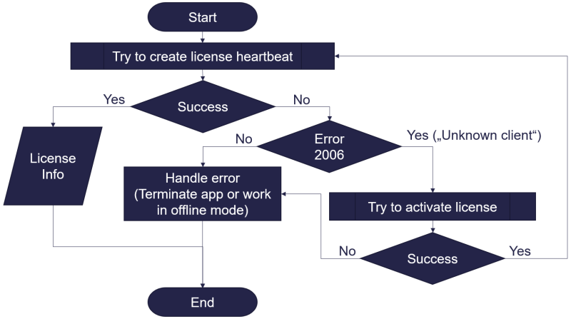
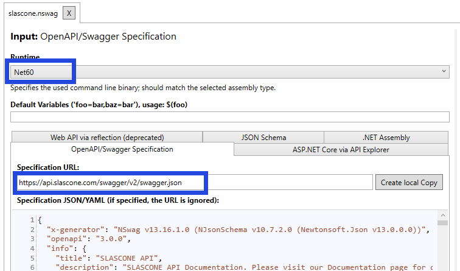
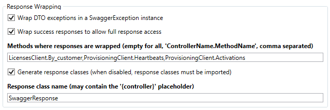

# SLASCONE-demo-csharp-device-floating

## C# code example for provisioning/activating of a client device with a floating license.

See the article on the Slascone Documentation site: [Floating device licenses](https://support.slascone.com/hc/en-us/articles/360016152858-FLOATING-DEVICE-LICENSES)

## Device ID

For a device license a unique device id is needed. In this example the unique identifier of the Windows system is used.

```
public static string GetWindowsUniqueDeviceId()
{
    using (var searcher = new ManagementObjectSearcher("SELECT UUID FROM Win32_ComputerSystemProduct"))
	{
		var shares = searcher.Get();
		var props = shares.Cast<ManagementObject>().First().Properties;
		var uuid = props["UUID"].Value as string;
		return uuid;
	}
}
```

You can find more infos about unique device id's in the article "[Generating a unique client id](https://support.slascone.com/hc/en-us/articles/360016157958-GENERATING-A-UNIQUE-CLIENT-ID)".

## License check

The license check is performed according to the following flowchart:



1. First step is to try to create a license heartbeat. The heartbeat is created using the unique device id.  
If a heartbeat is created successfully the license check is already done. The license info and the signature can be stored in 
local files in case of possible communication problems in the future. (such as no internet connection)
2. If the generation of the license heartbeat fails, different cases must be distinguished based on the error code.  
- Error code *2006* means that the device id is unknown to the slascone server. The next step then is to activate the license for the device.
- Other errors indicate a problem with the license.
- Problems communicating with the server can be dealt with using a special offline mode.

## Session handling

Opening, renewing and closing sessions is described in the article "[Floating device licenses](https://support.slascone.com/hc/en-us/articles/360016152858-FLOATING-DEVICE-LICENSES)"

## Handling communication problems

The license information can be saved locally on the device to enable work despite a missing connection to the Slascone server.
See the article 
"[What and how to save in your client](https://support.slascone.com/hc/en-us/articles/7702036319261-WHAT-AND-HOW-TO-SAVE-IN-YOUR-CLIENT)".

The manipulation of locally stored license information can be prevented by storing the signature provided by the Slascone server locally and validating the license information with it and with the public key provided.

See more information in the article "[Digital signature and data integrity](https://support.slascone.com/hc/en-us/articles/360016063637-DIGITAL-SIGNATURE-AND-DATA-INTEGRITY)"

## Client generation with NSwagStudio

This demo uses a Slascone client generated with NSwagStudio.

### Settings for client generation

Set the .NET runtime to "Net60" ad load the OpenAPI specification from [https://api.slascone.com/swagger/v2/]



#### CSharp Client Settings

The following settings differing from the default settings were used
to generate the client.

- Namespace: `SlasconeClient`
- Operation Generation Mode: _MultipleClientsForPathSegments_
- [x] Generate PrepareRequest and ProcessResponse as asynchronous methods  
This setting is necessary to get access to the body of the Http response. In order for the comparison with the signature to work, the exact byte image of the server response is required.
- Response Wrapping  

